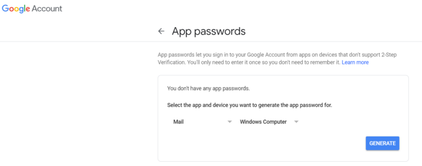

# Script to track Amazon prices 
The script tracks the price of an item on Amazon site. If the price is lower than defined as an argument, you will receive a mail. 
## What to do before run the script?

To send an email alert you need to do the 2-step verification of your Google acconut: <br />
1. Go to: https://www.google.com/landing/2step/
2. Enable the 2-step verification
3. Now you can set a password for the app. Go to Google Account and search "google app password" 

4. Click "Generate"
5. Copy the password from a pop-up window and use it in the agrument *--password*<br />

## How to use?
To run the script you need to typ in console:
```bash
python Track_price_Amazon.py --url "URL of Amazon product" --sender "sender's gmail addres" --password "sender's password" --reciver "reciver's email" --userAgent "your user agent" --price 9999
```
### What means arguments?
- **--url** - addres URL of Amazon product <br />
Exmaple: <br />
--ulr "https://www.amazon.de/-/pl/dp/B07XRR92LP/ref=zg_bs_3468301_23?_encoding=UTF8&psc=1&refRID=MBW4BYQD03MMZXZA2WD4" <br />

- **--sender** - sender's gmail addres <br />
Example: <br />
-- sender "sender_mail@gmail.com"

- **--passowrd
